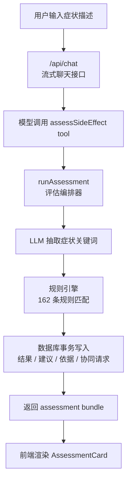

# 乳腺癌副作用评估 CDSS

一个最小可运行的乳腺癌副作用评估原型。用户可以在聊天框或评估页输入症状描述，系统返回风险等级、下一步建议、是否建议联系医疗团队，以及命中的规则依据。

> 说明：本项目是面试 demo / 原型系统，不构成医学建议。紧急情况请立即线下就医或联系医疗团队。

## 核心功能

- 症状输入：支持聊天框输入，也支持独立评估页 `/assess`
- 风险分层：高风险 / 中风险 / 低风险
- 结果卡片：展示风险等级、建议、命中规则和审计信息
- 历史记录：查看过往评估结果
- 协同请求：高风险时建议联系医疗团队
- 可观测性：记录 `assessment_started`、`assessment_submitted`、`result_viewed`、`contact_team_clicked`、`assessment_closed`

## 系统设计



## 评估逻辑

系统采用“规则引擎为主，LLM 辅助”的设计：

1. LLM 从用户描述中抽取症状关键词。
2. 规则引擎对原文和关键词做匹配。
3. 命中多条规则时，取最高风险等级。
4. 结果、建议、命中规则、生成时间和版本号都会写入数据库，方便审计追溯。

## 数据表

| 表 | 作用 |
|---|---|
| `Assessment` | 评估主记录 |
| `Advice` | 下一步建议 |
| `Evidence` | 命中规则和关键词依据 |
| `RuleSource` | 规则来源和版本 |
| `ContactRequest` | 联系团队请求 |
| `EventLog` | 用户行为事件 |

## 主要页面

- `/`：聊天入口
- `/assess`：独立评估页
- `/assess/[id]`：评估结果页
- `/history`：历史记录
- `/admin/assessments`：后台评估记录
- `/admin/events`：事件日志
- `/admin/rules`：规则库

## 技术栈

- Next.js App Router
- React
- TypeScript
- Tailwind CSS
- AI SDK
- Drizzle ORM
- PostgreSQL
- Auth.js
- Vitest / Playwright

## 本地运行

```bash
pnpm install
pnpm db:migrate
pnpm db:seed
pnpm dev
```

访问：

```text
http://localhost:3000
```

## 测试

```bash
pnpm test:unit       # 121 个 Vitest 单元测试
pnpm test:e2e        # Playwright e2e（需要 dev server + Postgres）
pnpm exec tsc --noEmit
```

当前已验证：

- 121 / 121 单元测试通过（risk engine、agent loop、telemetry、rules-cache、tools）
- 21 / 22 e2e 通过（剩 1 个 live-LLM 烟雾测试在无 API key 时跳过）
- TypeScript 类型检查 0 错误

## 更多说明

- [系统设计与 Agent 闭环](./INTERVIEW.md)

