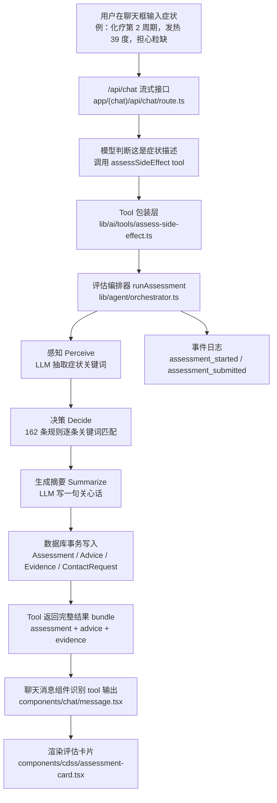
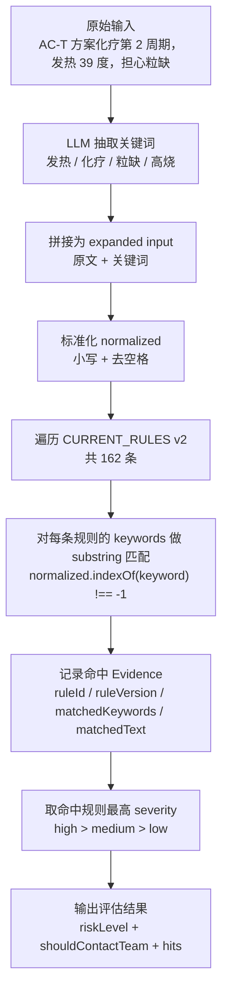

# 系统设计图：从聊天输入到结果卡片

## 主流程

```mermaid
flowchart TD
  A["用户在聊天框输入症状\n例：化疗第 2 周期，发热 39 度，担心粒缺"]
  B["/api/chat 流式接口\napp/(chat)/api/chat/route.ts"]
  C["模型判断这是症状描述\n调用 assessSideEffect tool"]
  D["Tool 包装层\nlib/ai/tools/assess-side-effect.ts"]
  E["评估编排器 runAssessment\nlib/agent/orchestrator.ts"]
  F["感知 Perceive\nLLM 抽取症状关键词"]
  G["决策 Decide\n162 条规则逐条关键词匹配"]
  H["生成摘要 Summarize\nLLM 写一句关心话"]
  I["数据库事务写入\nAssessment / Advice / Evidence / ContactRequest"]
  J["事件日志\nassessment_started / assessment_submitted"]
  K["Tool 返回完整结果 bundle\nassessment + advice + evidence"]
  L["聊天消息组件识别 tool 输出\ncomponents/chat/message.tsx"]
  M["渲染评估卡片\ncomponents/cdss/assessment-card.tsx"]

  A --> B --> C --> D --> E
  E --> J
  E --> F --> G --> H --> I --> K --> L --> M
```

## 规则判断内部逻辑

```mermaid
flowchart TD
  A["原始输入\nAC-T 方案化疗第 2 周期，发热 39 度，担心粒缺"]
  B["LLM 抽取关键词\n发热 / 化疗 / 粒缺 / 高烧"]
  C["拼接为 expanded input\n原文 + 关键词"]
  D["标准化 normalized\n小写 + 去空格"]
  E["遍历 CURRENT_RULES v2\n共 162 条"]
  F["对每条规则的 keywords 做 substring 匹配\nnormalized.indexOf(keyword) !== -1"]
  G["记录命中 Evidence\nruleId / ruleVersion / matchedKeywords / matchedText"]
  H["取命中规则最高 severity\nhigh > medium > low"]
  I["输出评估结果\nriskLevel + shouldContactTeam + hits"]

  A --> B --> C --> D --> E --> F --> G --> H --> I
```

## 一句话总结

聊天输入进入 `/api/chat` 后，模型调用 `assessSideEffect` tool；tool 触发 `runAssessment`，先用 LLM 抽关键词，再用 162 条规则做可审计匹配，最后把评估、建议、依据和审计信息写入数据库，并把完整结果流回前端渲染成评估卡片。
